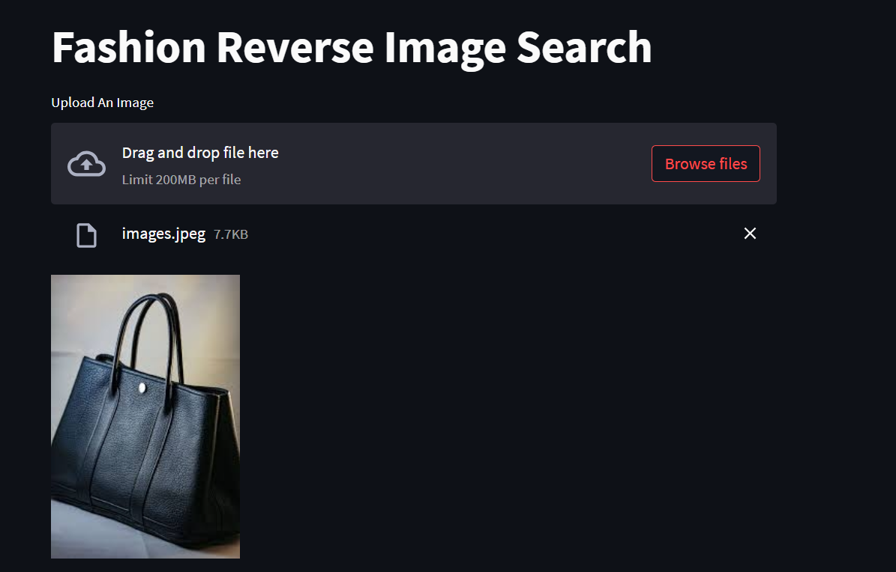
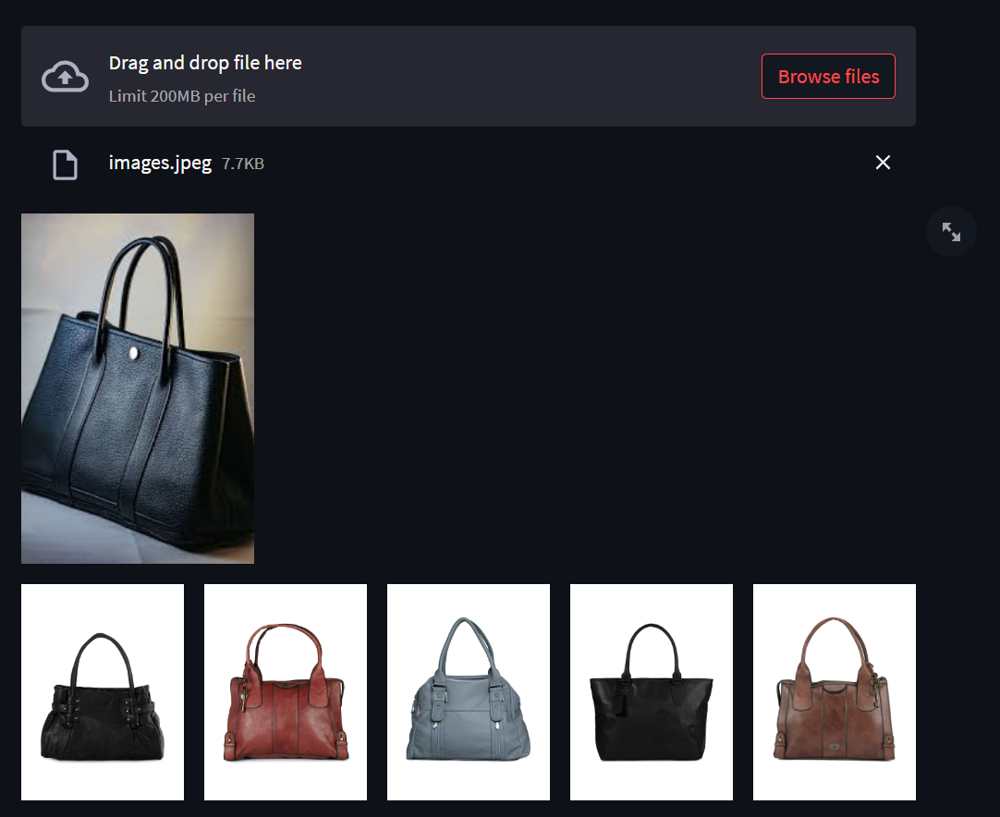

## 📌<b> Project Description : </b>

The deep learning fashion recommendation project is designed to provide users with an enhanced fashion shopping experience. By using deep learning techniques, this project aims to recommend similar fashion items to the input image provided by the user.

## ⚙️Functionality :

- User uploads an image of a fashion item or outfit that they like.
- The deep learning model analyzes the input image and extracts relevant features such as color, pattern, style, and more.
- Based on the extracted features, the model searches through a large dataset of fashion images.
- The model then uses similarity metrics to rank and select the top 5 images from the dataset that closely match the features of the input image.
- The recommended images are displayed to the user, providing them with a curated selection of fashion items that share similar visual characteristics to their input image.
- The user can click on the recommended images to view more details 

## 🏁 <b>Datasets Used:</b>
The dataset used is Fashion Product Images Dataset created by PARAM AGGARWAL. This dataset is also available on kaggle. For instance, to download this dataset [click here](https://www.kaggle.com/datasets/paramaggarwal/fashion-product-images-dataset).

## 📕 <b>Project Benefits:</b>
- <b>Enhanced User Experience</b>: Users can find visually similar fashion items to their preferred style without extensively searching through catalogs or websites.
- <b>Time-Saving</b>: The model performs the search and recommendation process rapidly, providing users with a quick and efficient solution for finding fashion recommendations.
- <b>Increased Fashion Exploration/<b>: Users can discover new fashion items or outfits that they may not have come across otherwise, expanding their fashion choices and preferences.
- <b>Personalized Recommendations</b>: The model learns from the user's input images, leading to more tailored recommendations over time.
- <b>Integration Possibilities</b>: The recommended fashion items can be linked to e-commerce platforms, allowing users to easily purchase their desired items.

## <b>Output Visulization :</b>

